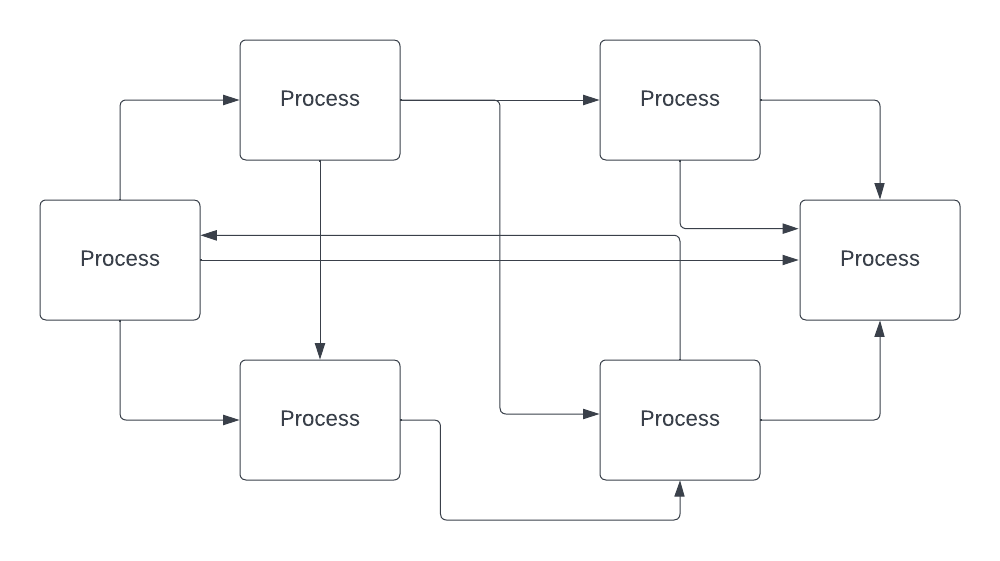
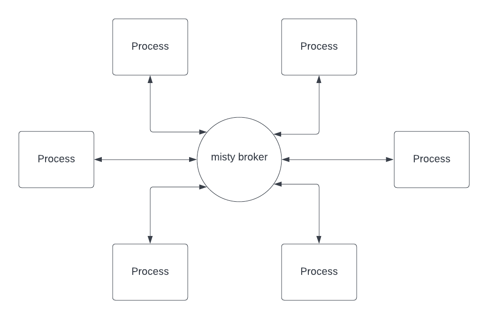

# misty
Client-Broker Architecture Service Mesh

## Overview

Misty is a client-broker architecture service message drawing on principles of [MQTT](https://en.wikipedia.org/wiki/MQTT) to provide easier service meshing and centralized communication within distributed systems.

Misty aims to untangle the message of event messaging across large distributed systems by replacing service-to-service communication with a centralized broker that uses topic-based messaging to allow services to subscribe to topics they rely on and publish to any topic to communicate to other services.

Here is a simple diagram of service-to-service event messaging paths (horrible!)

And here is an example of a misty-brokered event messaging flow (amazing!)

With misty service meshing, each process can publish data to a specific topic (i.e. `/loadbalancer/service-1`), and then any process that has subscribed to the topic (either specifically `/loadbalancer/service-1`, or with a wild card `/loadbalancer/*`) will receive the message, and can handle it accordingly.

Still a work in progress, addtional documentation to come soon.

## Examples

See the [examples](./examples/) section for working examples:

- [Misty Load Balancer](examples/load-balancer/README.md)
