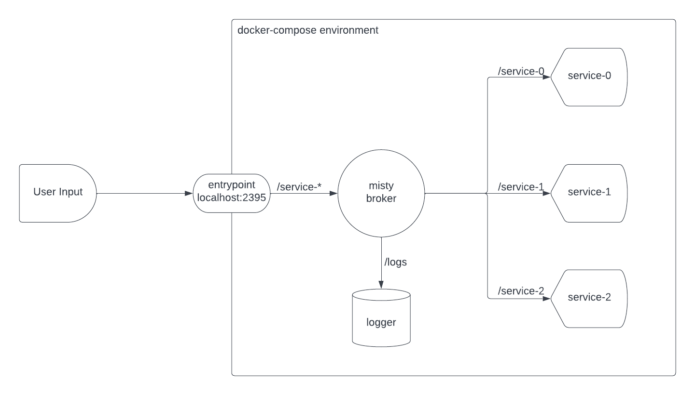

# Load Balancer Example

## Overview

In this example, a round robin load balancer is implemented using a misty-broker as a router for incoming messages to an exposed entrypoint (localhost:2395/). An additional logger component is used as a centralized collection of information about incoming messages and their routing history.

- First, a broker is created, and it starts listening on its own host (`broker:1315`), unaccessible from host machine). 
- Once the broker is created, the entrypoint is created. The entrypoint listens on the host IP (`localhost:2395`).
  - When a PUT request is made to `localhost:2395`, the entrypoint determines which service to send the message to using round-robin load balancing, and publishes the message to a specific topic `/service-*`.
  - The broker accepts this package, and routes the message to the specific service, since each service is subscribed to a specific topic `/service-0`, `service-1`, `service-2`, they receive the send message and can handle it accordingly.


## Instructions

1. Build the required Docker images using the bash script `./build-example.sh`

```bash
$ chmod a+x ./build-example.sh
$ ./build-example.sh
```

2. Run the `docker-compose` file

```bash
$ docker-compose up
Starting load-balancer_broker_1 ... done
Starting load-balancer_service-2_1  ... done
Starting load-balancer_service-0_1  ... done
Starting load-balancer_service-1_1  ... done
Starting load-balancer_logger_1     ... done
Starting load-balancer_entrypoint_1 ... done
Attaching to load-balancer_broker_1, load-balancer_service-0_1, load-balancer_service-2_1, load-balancer_service-1_1, load-balancer_logger_1, load-balancer_entrypoint_1
broker_1      | using configuration file: /.misty.yaml
broker_1      | 2022/11/25 17:34:00 Creating misty broker at http://localhost:1315...
broker_1      | 2022/11/25 17:34:00 Successfully added listener http://service-0:2397 to broker list
broker_1      | 2022/11/25 17:34:01 Subscribing listener http://service-0:2397 to topic=service-0
broker_1      | 2022/11/25 17:34:01 Successfully added listener http://service-1:2398 to broker list
broker_1      | 2022/11/25 17:34:01 Subscribing listener http://service-1:2398 to topic=service-1
entrypoint_1  | 2022/11/25 17:34:01 Creating entrypoint...
broker_1      | 2022/11/25 17:34:01 Successfully added listener http://service-2:2399 to broker list
broker_1      | 2022/11/25 17:34:01 Subscribing listener http://service-2:2399 to topic=service-2
broker_1      | 2022/11/25 17:34:01 Successfully added listener http://logger:2396 to broker list
broker_1      | 2022/11/25 17:34:01 Subscribing listener http://logger:2396 to topic=logs
```

3. Send some messages to the exposed entrypoint

```bash
$ curl -X PUT localhost:2395/ -d "fear fun"
broker_1      | 2022/11/25 17:34:39 Received Received message="fear fun", forwarding to service-0 on logs
broker_1      | 2022/11/25 17:34:39 Broadcasting Received message="fear fun", forwarding to service-0 to http://logger:2396/logs
logger_1      | 2022/11/25 17:34:39 [RECEIVED ON /logs]: Received message="fear fun", forwarding to service-0
entrypoint_1  | 2022/11/25 17:34:39 Successfully published Received message="fear fun", forwarding to service-0 on /logs
broker_1      | 2022/11/25 17:34:39 Received fear fun on service-0
broker_1      | 2022/11/25 17:34:39 Broadcasting fear fun to http://service-0:2397/service-0
service-0_1   | 2022/11/25 17:34:39 [RECEIVED ON /service-0]: fear fun

$ curl -X PUT localhost:2395/ -d "ily honeybear"
broker_1      | 2022/11/25 17:34:49 Received Received message="ily honeybear", forwarding to service-1 on logs
broker_1      | 2022/11/25 17:34:49 Broadcasting Received message="ily honeybear", forwarding to service-1 to http://logger:2396/logs
logger_1      | 2022/11/25 17:34:49 [RECEIVED ON /logs]: Received message="ily honeybear", forwarding to service-1
entrypoint_1  | 2022/11/25 17:34:49 Successfully published Received message="ily honeybear", forwarding to service-1 on /logs
broker_1      | 2022/11/25 17:34:49 Received ily honeybear on service-1
broker_1      | 2022/11/25 17:34:49 Broadcasting ily honeybear to http://service-1:2398/service-1
service-1_1   | 2022/11/25 17:34:49 [RECEIVED ON /service-1]: ily honeybear

$ curl -X PUT localhost:2395/ -d "pure comedy"
broker_1      | 2022/11/25 17:35:52 Received Received message="pure comedy", forwarding to service-2 on logs
broker_1      | 2022/11/25 17:35:52 Broadcasting Received message="pure comedy", forwarding to service-2 to http://logger:2396/logs
logger_1      | 2022/11/25 17:35:52 [RECEIVED ON /logs]: Received message="pure comedy", forwarding to service-2
entrypoint_1  | 2022/11/25 17:35:52 Successfully published Received message="pure comedy", forwarding to service-2 on /logs
broker_1      | 2022/11/25 17:35:52 Received pure comedy on service-2
broker_1      | 2022/11/25 17:35:52 Broadcasting pure comedy to http://service-2:2399/service-2
service-2_1   | 2022/11/25 17:35:52 [RECEIVED ON /service-2]: pure comedy
```

Alternatively, you can run the following mini-bash script:

```bash
curl -X PUT localhost:2395/ -d "fear fun"
curl -X PUT localhost:2395/ -d "ily honeybear"
curl -X PUT localhost:2395/ -d "pure comedy"
```

## System Architecture Diagram



